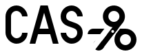

<div align="center" class="logo">
  
</div>

Cas-9 is a tiny JavaScript framework (618 bytes gzipped). Much like [SolidJS](https://docs.solidjs.com/), it uses JSX function components and fine-grained reactivity without a VDOM. Cas-9 focuses on minimalism and uses [Alien Signals](https://github.com/stackblitz/alien-signals) for state, which is currently the fastest JavaScript signals implementation.

## Why the name?

In molecular biology, "Cas9" is the "gene scissors" molecule used to make small targeted edits to DNA. This library is the size of a molecule and makes small targeted updates to the DOM.

## Get started using Cas-9 with Vite
```sh
npx degit jrood/cas-9-starter my-app
cd my-app
npm i
npm run dev
```

## An example counter

```tsx
import { signal } from 'alien-signals';
import { render } from 'cas-9';

function Counter() {
  const count = signal(0);
  return (
    <button
      onClick={() => count(count() + 1)}
    >
      {count}
    </button>
  );
}

render(Counter, document.body);
```
